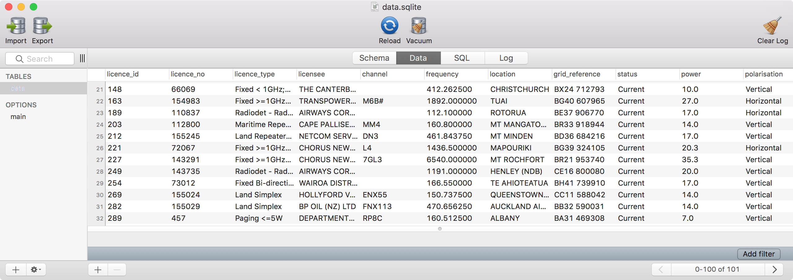

# A morph.io scraper for getting the NZ radio spectrum management licence data

This is a scraper that runs on
[morph.io](https://morph.io/tatey/new-zealand-radio-spectrum-licenses).

## System Dependencies

* [Ruby 2.3](https://www.ruby-lang.org)
* [Bundler](https://rubygems.org/gems/bundler)
* [PhantomJS](http://phantomjs.org)

## Usage

Install the scraper's dependencies:

    $ bundle

Run the scraper:

    $ ./bin/scrape

The scraper will perform a search and then scrape each of the licences into
a SQLite database named `data.sqlite`.
